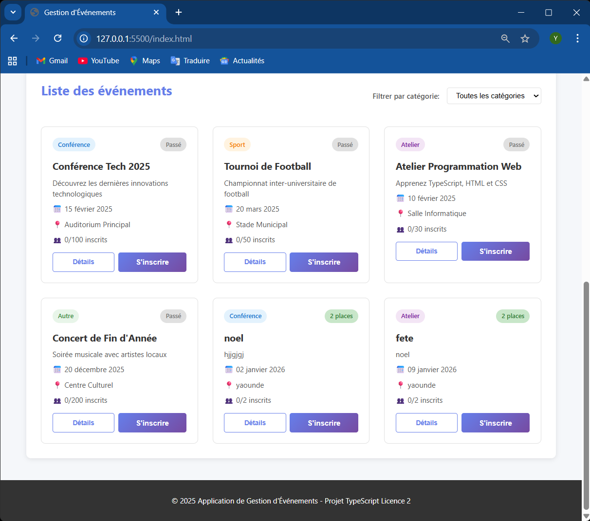
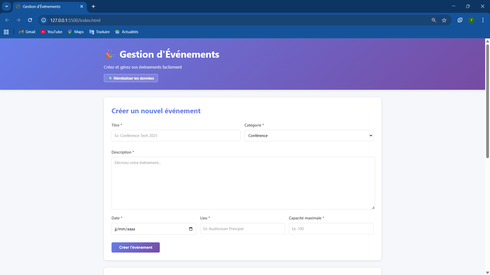
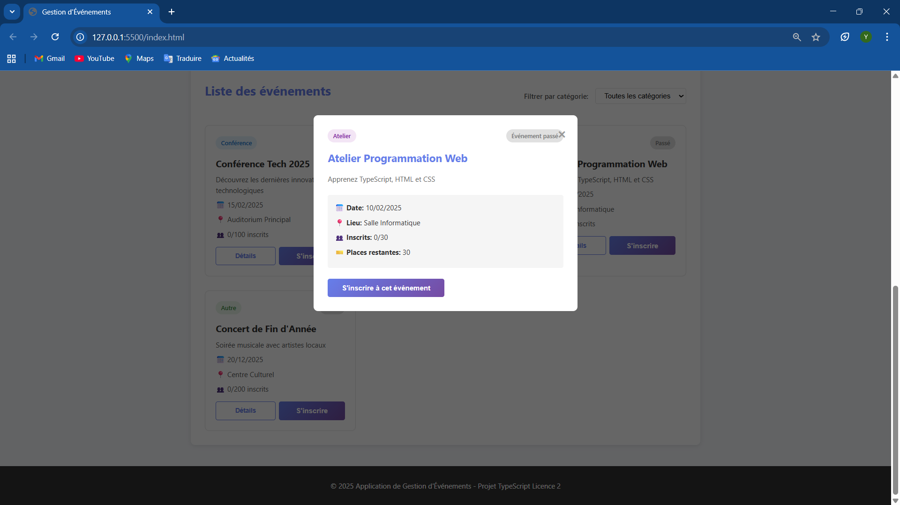
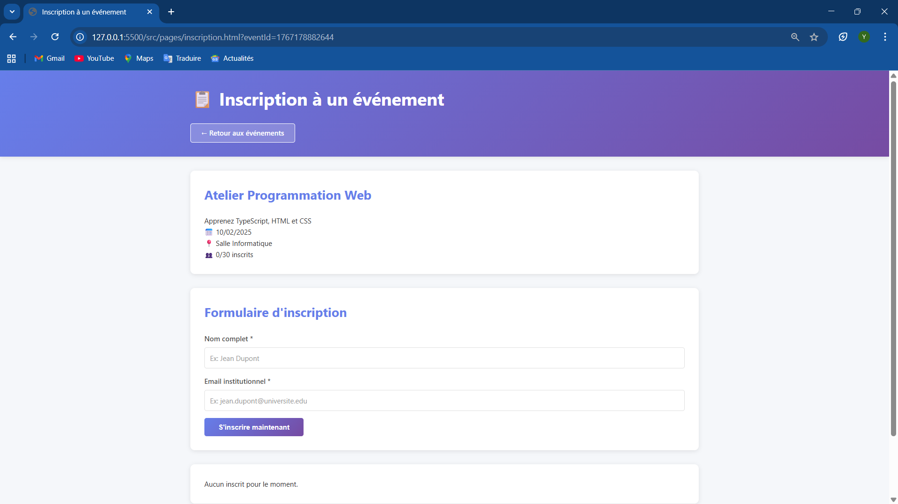
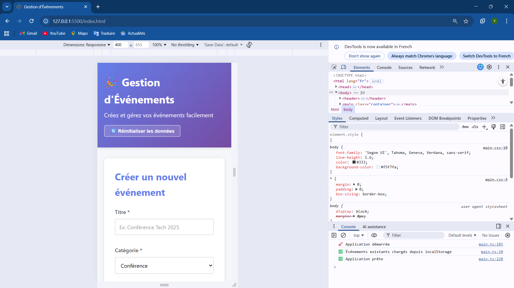

# 🎉 Application Web de Gestion d'Événements

## 1. Présentation du projet

Cette application web permet de créer, afficher et gérer des événements, ainsi que de gérer les inscriptions des utilisateurs à ces événements. 

Le projet a été développé entièrement en **TypeScript** sans aucun framework externe, en respectant les principes de la **programmation orientée objet (POO)**.

**Objectifs fonctionnels :**
- Créer des événements avec toutes les informations nécessaires
- Afficher et filtrer les événements par catégorie
- Consulter les détails complets de chaque événement
- Permettre aux utilisateurs de s'inscrire aux événements
- Gérer automatiquement la capacité et éviter les doublons d'inscription

**Technologies utilisées :** TypeScript, HTML5, CSS3 (sans framework)

---

## 2. Fonctionnalités développées

| Fonctionnalité | Statut |
|----------------|--------|
| Création d'évènements | ✅ OK |
| Affichage de la liste complète | ✅ OK |
| Filtre par catégorie | ✅ OK |
| Page détail d'un événement | ✅ OK |
| Inscription d'un utilisateur | ✅ OK |
| Vérification des doublons | ✅ OK |
| Gestion capacité & places restantes | ✅ OK |
| Validation email | ✅ OK |
| Interface responsive | ✅ OK |

---

## 3. Structure du projet

```
event-app/
│── index.html                  → page principale UI
│── styles/
│   └── main.css               → style complet du projet
│── dist/                      → fichiers compilés (généré auto)
│   ├── main.js
│   ├── models/
│   │   ├── Event.js
│   │   ├── User.js
│   │   ├── Registration.js
│   │   └── EventManager.js
│   └── scripts/
│       └── inscription.js
│── src/
│   ├── models/                → définitions des classes
│   │   ├── Event.ts           → classe Event
│   │   ├── User.ts            → classe User
│   │   ├── Registration.ts    → classe Registration
│   │   └── EventManager.ts    → gestionnaire principal
│   ├── pages/                 → pages HTML supplémentaires
│   │   └── inscription.html   → page d'inscription
│   ├── scripts/               → scripts TypeScript des pages
│   │   └── inscription.ts     → logique page inscription
│   └── main.ts                → point d'entrée principal
│── tsconfig.json              → configuration TypeScript
│── package.json               → gestion du projet + scripts
│── .gitignore                 → exclusion node_modules, dist
└── README.md                  → cette documentation
```

### Explication des dossiers

- **src/models/** : Contient toutes les classes TypeScript (Event, User, Registration, EventManager)
- **src/pages/** : Pages HTML secondaires (inscription)
- **src/scripts/** : Scripts TypeScript pour les pages secondaires
- **src/main.ts** : Point d'entrée principal qui gère la page d'accueil
- **dist/** : Fichiers JavaScript compilés automatiquement (NE PAS MODIFIER)
- **styles/** : Fichiers CSS pour l'interface utilisateur

---

## 4. Installation & lancement

### Prérequis
- **Node.js** (version 14 ou supérieure)
- **npm** (installé avec Node.js)

### Étapes d'installation

#### 1) Cloner le dépôt
```bash
git clone <votre-url-github>
cd event-app
```

#### 2) Installer les dépendances
```bash
npm install
```

#### 3) Compiler le TypeScript
```bash
npm run build
```

#### 4) Lancer l'application
**Option 1 : Ouvrir directement**
- Double-cliquer sur `index.html`

**Option 2 : Utiliser Live Server (recommandé)**
- Dans VS Code : Clic droit sur `index.html` → "Open with Live Server"

### Commandes npm disponibles

```bash
npm run build   # Compile TypeScript vers JavaScript
npm run watch   # Compile automatiquement à chaque modification
npm start       # Compile et affiche les instructions
```

---

## 5. Mode d'utilisation de l'application

### 🎯 Comment créer un évènement ?

1. Sur la page d'accueil, remplir le formulaire **"Créer un nouvel événement"**
2. Renseigner tous les champs obligatoires :
   - **Titre** : Nom de l'événement
   - **Catégorie** : Conférence / Sport / Atelier / Autre
   - **Description** : Détails de l'événement
   - **Date** : Date de l'événement
   - **Lieu** : Localisation
   - **Capacité** : Nombre maximum de participants
3. Cliquer sur **"Créer l'événement"**
4. L'événement apparaît immédiatement dans la liste

### 🔍 Comment filtrer les événements ?

1. Utiliser le menu déroulant **"Filtrer par catégorie"** en haut de la liste
2. Sélectionner une catégorie spécifique (Conférence, Sport, Atelier, Autre)
3. La liste se met à jour automatiquement
4. Sélectionner "Toutes les catégories" pour tout réafficher

### 📋 Comment voir les détails d'un événement ?

1. Cliquer sur le bouton **"Détails"** sur une carte d'événement
2. Une fenêtre modale s'ouvre avec :
   - Toutes les informations de l'événement
   - Le nombre de places restantes
   - Le statut (Disponible / Complet / Passé)
3. Cliquer sur la croix (×) ou en dehors de la modal pour fermer

### ✍️ Comment s'inscrire à un événement ?

1. Cliquer sur le bouton **"S'inscrire"** sur une carte d'événement
2. Vous serez redirigé vers la page d'inscription
3. Remplir le formulaire avec :
   - **Nom complet**
   - **Email institutionnel**
4. Cliquer sur **"S'inscrire maintenant"**
5. Un message confirme l'inscription
6. Votre nom apparaît dans la liste des participants

### ⚠️ Que se passe-t-il si l'événement est plein ?

- Le badge **"Complet"** s'affiche sur la carte
- Le formulaire d'inscription est **désactivé**
- Un message indique que l'événement est complet
- Il est impossible de s'inscrire

### 📅 Événements passés

- Les événements passés affichent le badge **"Passé"**
- Le formulaire d'inscription est **automatiquement désactivé**
- Un message indique que l'événement est déjà terminé

---

## 6. Captures d'écran

### Page d'accueil (liste d'événements)
> 
> 
> *Vue de la page principale avec la liste des événements et le filtre par catégorie*

### Formulaire de création
> 
> 
> *Formulaire permettant de créer un nouvel événement*

### Modal de détails
> 
> 
> *Fenêtre modale affichant les détails complets d'un événement*

### Page d'inscription
> 
> 
> *Page dédiée à l'inscription avec formulaire et liste des participants*

### Vue responsive mobile
> 
> 
> *Interface adaptée pour les smartphones et tablettes*

---

## 7. Conclusion & limites

### ✅ Ce qui fonctionne bien

- **Architecture propre** : Séparation claire entre modèles, vues et logique (pattern MVC-like)
- **Validation robuste** : Gestion des doublons, capacité maximale, emails invalides, événements passés
- **Interface intuitive** : Design moderne et responsive avec retours visuels clairs
- **Gestion de l'état** : Données partagées efficacement entre les pages via singleton
- **Code TypeScript** : Types stricts, classes bien organisées, modules ES6

### 🎯 Difficultés rencontrées

- **Compilation TypeScript** : Configuration initiale de tsconfig.json pour ES6 modules
- **Partage de données** : Synchronisation de l'état entre les différentes pages HTML sans localStorage
- **Chemins relatifs** : Gestion des imports et des liens entre pages dans des dossiers différents
- **Validation email** : Mise en place d'une regex simple mais efficace pour les emails institutionnels

### 🚀 Améliorations possibles avec plus de temps


- **Recherche avancée** : Ajouter une barre de recherche par mots-clés et filtre par date
- **Authentification** : Système de connexion pour gérer les profils utilisateurs
- **Notifications** : Alertes et rappels automatiques pour les événements à venir
- **Gestion avancée** : Permettre la modification et suppression d'événements
- **Export de données** : Télécharger la liste des participants en CSV/PDF
- **Mode sombre** : Thème sombre activable pour le confort visuel
- **Multi-langues** : Support de plusieurs langues (français, anglais)
- **Statistiques** : Dashboard avec graphiques et analyses des inscriptions

---

## 8. Informations auteur

| Champ | Information |
|-------|-------------|
| **Nom & Prénom** | [SIHNO NDONGO YANN] |
| **Matricule** | [2425L025] |
| **Email** | [yann.sihno@saintjeaningenieur.org] |
| **Niveau** | Licence 2 - TypeScript |
| **Date de remise** | 31 Décembre 2025 |

---

## 📝 Notes techniques

### Architecture
- **Pattern utilisé** : MVC (Model-View-Controller) simplifié
- **Modules** : ES6 avec import/export
- **POO** : Classes avec encapsulation, méthodes publiques/privées
- **Singleton** : Instance unique du EventManager partagée

### Sécurité et validation
- Validation des emails avec expression régulière
- Vérification systématique des doublons d'inscription
- Contrôle strict de la capacité maximale
- Désactivation automatique pour événements passés ou complets
- Sanitization des entrées utilisateur (trim, validation)

### Compatibilité
- Navigateurs modernes (Chrome, Firefox, Safari, Edge)
- Responsive design : mobile, tablette, desktop
- ES6+ JavaScript
- TypeScript 5.x

---

## 🔗 Liens utiles

- **Dépôt GitHub** : [votre-url-github]
- **Documentation TypeScript** : https://www.typescriptlang.org/
- **Consignes du projet** : Voir PDF fourni par le professeur

---

**Projet réalisé dans le cadre du cours de TypeScript**  
**Licence 2 - Année académique 2025-2026**  
**Enseignant : Daniel KINKEU**

---

*"L'école ce n'est pas le piège, ensemble luttons contre le travail de la dernière minute"* 😊